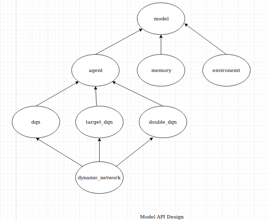

<pre>

usage: main.py [-h] [--id ID] [-tr] [-ts] [-yf YAML_FILE]
               [--explore_start EXPLORE_START] [--explore_stop EXPLORE_STOP]
               [--decay_rate DECAY_RATE] [-aer AVG_EXPECTED_REWARD]
               [--model_save MODEL_SAVE] [--memory_save MEMORY_SAVE]
               [-er EPISODE_RENDER] [--max_steps MAX_STEPS]
               [--max_episodes MAX_EPISODES]
               [--training_frequency TRAINING_FREQUENCY]
               [--batch_size BATCH_SIZE] [--pretrain_length PRETRAIN_LENGTH]
               [--pretrain_init {random,agent}] [--for_all] [--plot]
               [--only_plot] [--total_episodes TOTAL_EPISODES]
               [--restore_model] [--restore_memory]

optional arguments:
  -h, --help            show this help message and exit
  --id ID               give folder id
  -tr, --train          train with given folder id
  -ts, --test, --evaluate, -ev
                        test with given folder id, folder id is folder name in
                        data
  -yf YAML_FILE, --yaml_file YAML_FILE
                        hyper-parameters file
  --explore_start EXPLORE_START
                        exploring probability at start
  --explore_stop EXPLORE_STOP
                        minimum exploring probablity
  --decay_rate DECAY_RATE
                        decaying rate of exploring
  -aer AVG_EXPECTED_REWARD, --avg_expected_reward AVG_EXPECTED_REWARD
                        Average expected reward
  --model_save MODEL_SAVE
                        Model saving after given number of episodes
  --memory_save MEMORY_SAVE
                        Memory saving after given number of episodes
  -er EPISODE_RENDER, --episode_render EPISODE_RENDER
                        Episode Rendering after given number of episodes
  --max_steps MAX_STEPS
                        maximum number of steps for training the agent
  --max_episodes MAX_EPISODES
                        maximum number of episodes for training the agent.
                        This has higher precedence over max_steps
  --training_frequency TRAINING_FREQUENCY
                        training periodically after given steps in each
                        episode
  --batch_size BATCH_SIZE
                        batch size of experiences to give Network
  --pretrain_length PRETRAIN_LENGTH
                        pretraining experiences
  --pretrain_init {random,agent}
                        pretraining randomly or with agent
  --for_all             Only to be used if testing. this flag will evaluate
                        all saved models
  --plot                Only to be used if testing. this flag will plot
                        rewards and losses during training
  --only_plot           plots rewards and losses during training, give
                        folder_id
  --total_episodes TOTAL_EPISODES
                        testing will done for given number of episodes
  --restore_model       only to be used to restore model for training purpose
  --restore_memory      only to be used if saved memory during training, want
                        to restore that memory

</pre>
